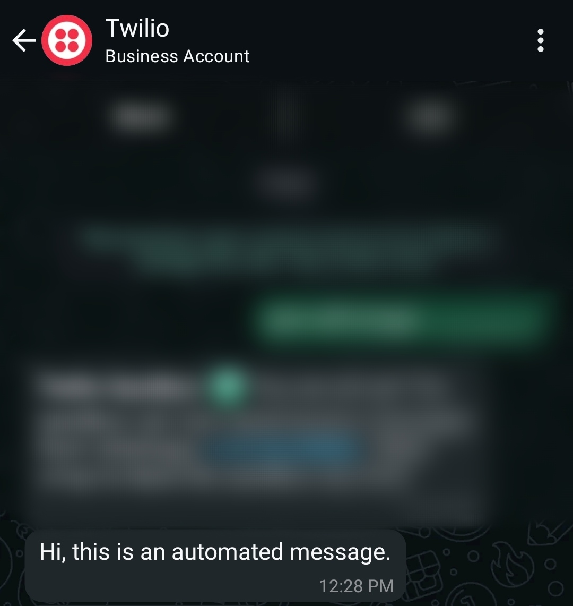

# WhatsApp Message Automation

This project allows you to schedule and send WhatsApp messages using the Twilio API. You can input the recipient's name, phone number, message, and the date and time you want the message to be sent.

## Installation

1. Clone the repository:
    ```sh
    git clone https://github.com/nilaysarma/whatsapp-message-automation.git
    ```

2. Install the required libraries:
    ```sh
    pip install twilio
    ```

## Usage

1. Open the main.py file and fill account_sid and auth_token with your Twilio account credentials:
    ```python
    account_sid = 'your_account_sid'
    auth_token = 'your_auth_token'
    ```

2. Run the script:
    ```sh
    python main.py
    ```

3. Follow the prompts to enter the recipient's name, phone number, message, and the date and time you want the message to be sent.

## Example

```sh
Enter the recipient name: Nilay
Enter the recipient WhatsApp number with country code: +910123456789
Enter the message you want to send to Nilay: Hi, this is an automated message.
Enter the date you want to send the message (YYYY-MM-DD): 2023-12-23
Enter the time you want to send the message (HH:MM in 24 hour format): 12:28
Message scheduled to be sent to Nilay at 2023-12-23 12:28:00.
Message sent successfully! Message SID: SMXXXXXXXXXXXXXXXXXXXXXXXXXXXXXXXX
```

